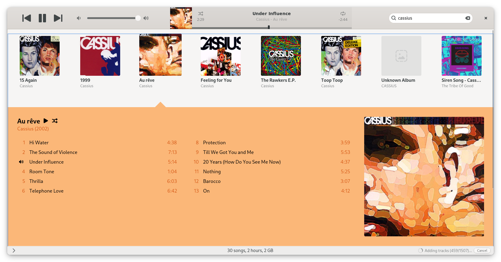
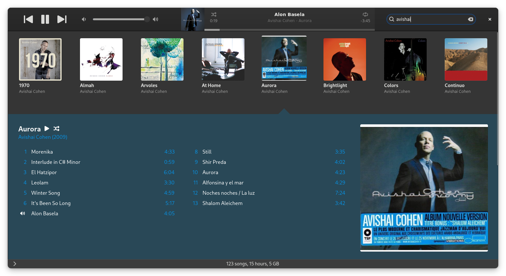
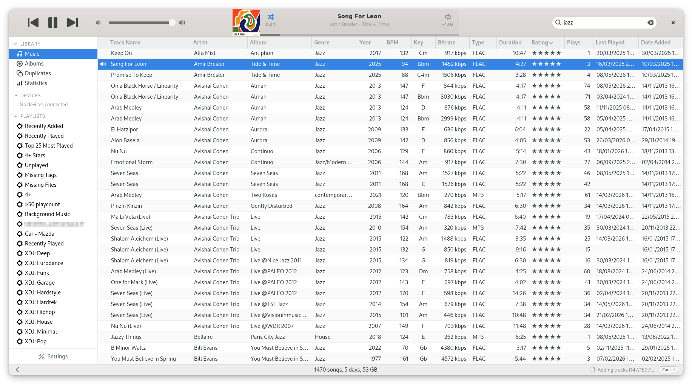
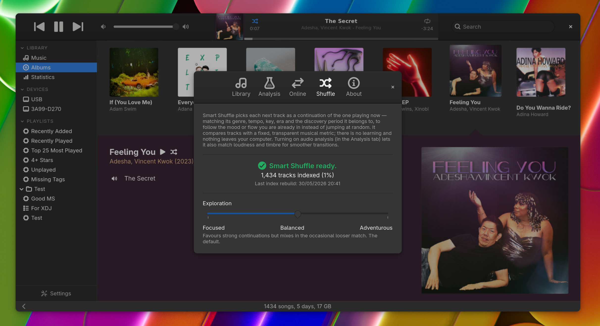
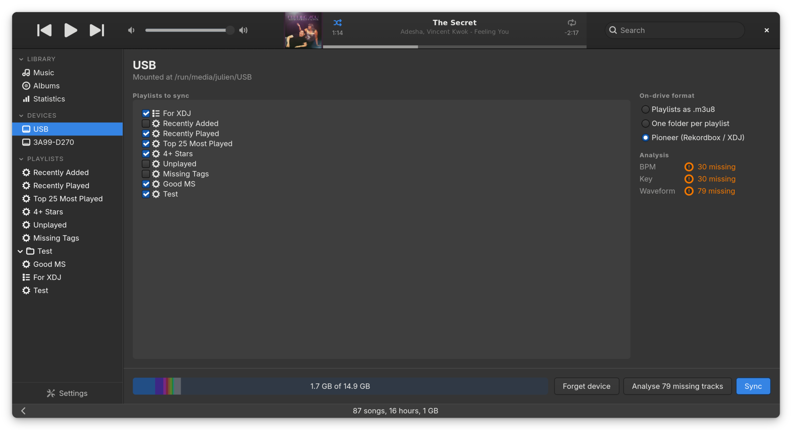
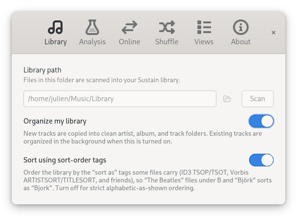
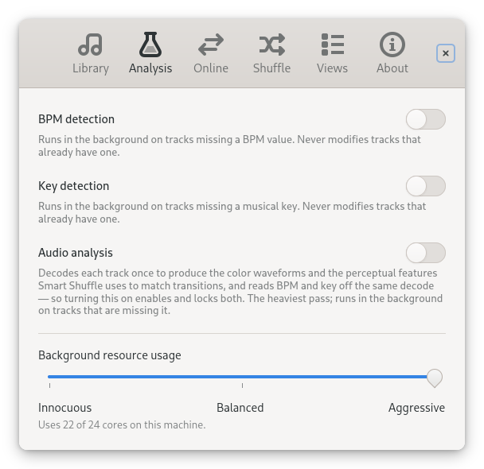
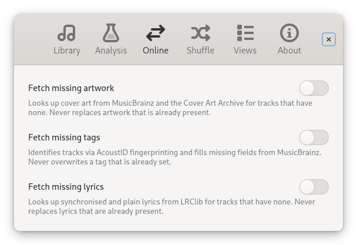

<h1>
  
  Sustain
</h1>




<p align="center">
	
	
</p>

<p align="center">
	
	
</p>

<p align="center">
  
  
  
</p>

Sustain (`open-sustain/sustain`) is a Linux music player heavily inspired by old iTunes builds.

> I was an Apple fanboy during the iTunes golden era (2005-2015).
> Each new release was a treat and what I still miss years after switching to Linux.
> Advent of solid LLM agents in late 2025 allowed me to get a spiritual successor rolling.

This player is not pixel-perfect iTunes taxidermy for a few reasons :
- each versions brought and took away good things, I'm cherry picking what I believe to be tasteful,
- captivity has been converted into freedom, especially sync, which isn't iPod-bound
- features for local-first music lovers have been added.

This player is not designed by commity. 
It's autoritarian*, as I believe was the case for most good Apple products.

The interface respects both light and dark modes natively. It leverages GNOME's core features to strike the right balance of bespoke visual components without abusing GTK or fighting the desktop environment. For instance, it uses your native system icons and accent colors out of the box.

The library management has two modes, similar to what iTunes did :
- "Don't touch my files" (default), which only scans a designated library folder. In this mode, your audio files can only be "enhanced" by populating more ID.3 tags. They are never moved or re-organized.
- "Keep my library organized", which arranges and sorts the files cleanly by Artist and Album in the designated library folder. 

Managed-library organization can depend on hard links to move files without
copying file contents and without overwriting existing files. This is suitable
for normal local Linux filesystems such as ext4, XFS, Btrfs, and ZFS, but it can
fail on filesystems or mounts that do not support hard links, such as some SMB,
FUSE, FAT/exFAT, or restricted network shares. Sustain permits those locations
for "Don't touch my files" indexing and playback, but refuses to enable or run
organized-library mutations there. Metadata edits still mirror tags back to
individual files when each target filesystem can publish the replacement
safely; otherwise SQLite remains authoritative and Sustain retains the pending
mirror for retry. A behavioral preflight catches incompatible organized roots,
but no probe can prove crash durability: use a normal local Linux filesystem
for "Keep my library organized".

`*` _If you have ideas I'm open to discussion. A consolidated Sustain is probably preferable over a fork with marginal changes._

## Stack

* Language: Rust (for speed, safety, and keeping the codebase maintainable)
* UI: GTK4 (integrated natively with GNOME)
* Audio Engine: GStreamer
* Database: SQLite

No Electron, no web wrappers. It’s built to be fast, lightweight, and play nice with pretty much any Linux distro.

## Features

See [docs/features.md](docs/features.md) for the full reference.

Implemented:
- Library management with two modes — "Don't touch my files" or "Keep my library organized" (*iso-iTunes*)
- Sidebar-driven navigation — LIBRARY (Music, Albums, Statistics) and PLAYLISTS — with a collapsible left column (*Sustain-native*)
- Dense, keyboard-friendly Music and playlist track tables, full-width album grid (*iso-iTunes*)
- Playlists, smart playlists, and playlist folders (*iso-iTunes*)
- 5-star ratings, play count, skip count, last played, last skipped (*iso-iTunes*)
- Up Next queue with `Play Next` and `Add to Queue` (*iso-iTunes*)
- Real-time search, sortable and customizable columns (*iso-iTunes*)
- Library-wide Statistics screen — genre and bitrate distributions, most-played and most-liked genres, release-year and year-added histograms (*Sustain-native*)
- Background BPM and musical-key detection, with a tempo/harmony-aware smart-playlist rule engine (*Sustain-native*)
- Background backfill of artwork, ID3 tags, and lyrics via MusicBrainz, Cover Art Archive, AcoustID, and LRClib (*iTunes-adjacent*)
- Smart Shuffle that picks each next track as a continuation of the one playing — a local, transparent perceptual match, no cloud, no learning (*Sustain-native*)
- Sync playlists and smart playlists to USB sticks and SD cards, incrementally — as a deduplicated `.m3u8` tree or one folder per playlist (*Sustain-native*)
- **CDJ/XDJ-ready Rekordbox export** — writes the full Pioneer feature set to the drive (BPM, key, beat grids, waveforms and artwork) so the hardware reads it natively; the only Linux music app I know of that does this, not just copies files (*Sustain-native*)
- Native light / dark theme and system accent color (*Sustain-native*)

## Roadmap

- Duplicates consolidation (preserve the best audio version, aggregate tags)
- Sync to Android phones over MTP (USB/SD-card sync and Pioneer Rekordbox export already ship)

## Install

Pre-built artefacts are attached to each [GitHub release](https://github.com/open-sustain/sustain/releases).

**Debian / Ubuntu (amd64 or arm64)** — the same `.deb` is built against Debian trixie's GTK 4.18 and is verified to install cleanly on Ubuntu 25.10 and Ubuntu 26.04 LTS.

```sh
sudo apt install ./sustain_<version>_<arch>.deb
```

**Any other Linux distribution (Fedora, openSUSE, Elementary, Zorin, Mint, …)** — install the Flatpak bundle from the same release. It runs against the `org.gnome.Platform//48` runtime and brings its own GTK 4 / GStreamer stack.

```sh
flatpak install --user ./sustain.flatpak
flatpak run io.github.open_sustain.sustain
```

A Flathub submission will follow once the application stabilises.

## Key locations

- Config: `~/.config/sustain/settings.toml`
- Database: `~/.local/share/sustain/library.sqlite`

## Development

```sh
sudo apt install libgtk-4-dev libgstreamer1.0-dev libgstreamer-plugins-base1.0-dev

cargo run -p sustain-app
cargo test --workspace
cargo clippy --workspace --all-targets
```

### Running against a throwaway library

By default — installed or via `cargo run` — Sustain reads and writes the
real user locations above. To work on a branch without touching the
installed instance's library, settings, or artwork cache, isolate the
dev instance with CLI flags (after `--`):

```sh
# Keep config, database, and cache in the current directory
# (sustain.toml, sustain.sqlite, sustain.cache/):
cargo run -p sustain-app -- --local-scope

# Or point at explicit files (both accept absolute or relative paths):
cargo run -p sustain-app -- --config /tmp/dev.toml --database /tmp/dev.sqlite
```

`--local-scope` (alias `--dev`) is the recommended way to run against
anything other than the installed user's real library. Explicit
`--config` / `--database` win over `--local-scope`, and whenever any of
these flags is present Sustain never falls back to the XDG locations —
the instance is fully self-contained. The resolved paths are printed at
startup. The single-instance lock keys off the resolved database path,
so a dev instance and the installed one coexist.


### A note on the AI development

It’s easy to look at this and write it off as "just another AI app."

But directing this project took weeks of full-time work, even with the best LLM agents available. Even without writing a single line of code, crafting a mature, high-quality app still takes serious human expertise.

A huge amount of time went into the engineering details: anticipating race conditions, resolving conflicting features, optimizing performance, and making sure the code quality doesn't degrade. It still requires doing the research, choosing between different technical approaches, ensuring the app is a good citizen with online services, making sure it’s gentle on the user's hardware, testing features, and maintaining strict visual consistency.

### Why Linux only

Sustain won't ship for macOS or Windows. Doing it right would mean a native rewrite per platform (proper AppKit/Win32, not GTK bolted onto a foreign desktop) plus replacing all the wiring that just isn't there or isn't clean off Linux. That's most of the invisible work that built Sustain, all over again.

It's also not where I want to be. Windows is a dying OS, and the direction Apple has taken for years isn't something I can condone.

Seeing where Apple Music is today, there's probably room for a deshitified iTunes on macOS, and some users over there would likely appreciate it. Just not from me.


## No Apple intellectual property

This project was written from scratch in Rust, against GTK4 and GStreamer. No Apple source code was read, decompiled, disassembled, or reverse-engineered in the making of Sustain. No Apple binaries, icons, fonts, artwork, sound effects, or localized strings are bundled or redistributed here. The visual and behavioral inspiration comes entirely from my memory and taste as a long-time iTunes user — i.e. from the publicly observable user experience of the application, which is not protected by copyright under EU law (cf. CJEU C-406/10, *SAS Institute v. World Programming*). Sustain is not affiliated with, endorsed by, or connected to Apple Inc. in any way. "iTunes" and "Apple Music" are trademarks of Apple Inc., referenced here only descriptively.
